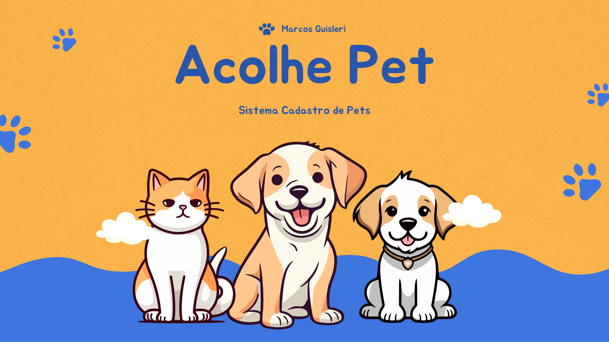
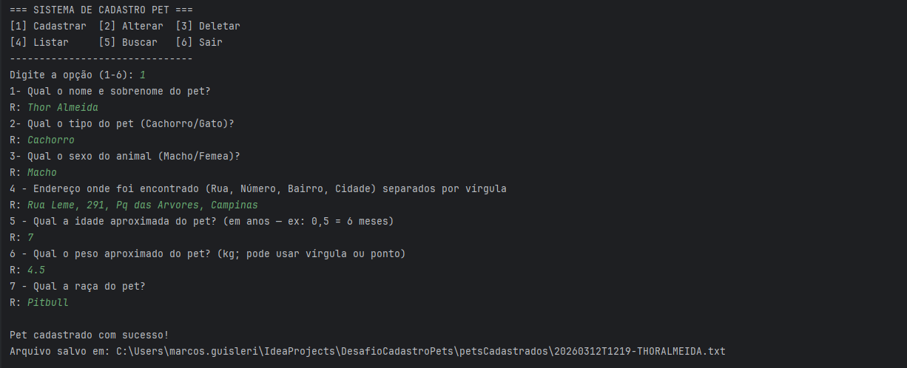

<div align="center">



<br/>

[](https://openjdk.org/)
[](https://maven.apache.org/)
[]()

<br/>

> Implementação independente do desafio criado por [**Lucas Carrilho (@devmagro)**](https://github.com/karilho/desafioCadastro) e [**Alberto Huber**](https://github.com/karilho/desafioCadastro).
> Repositório original: [karilho/desafioCadastro](https://github.com/karilho/desafioCadastro)

</div>

---

## 📋 Sobre o projeto

**Acolhe Pet** é um sistema de cadastro de pets via **CLI (linha de comando)** desenvolvido em Java puro, com orientação a objetos, persistência em arquivo e validações de domínio. O objetivo é permitir que um abrigo de animais gerencie seus pets disponíveis para adoção — cadastrando, buscando, alterando e deletando registros.

---

## 🖥️ Demo

> 📸 Sistema em execução...
> 


---

## ✅ Progresso do desafio

| Passo | Funcionalidade | Status |
|-------|----------------|--------|
| 1 | Leitura do `formulario.txt` e exibição no terminal | ✅ Concluído |
| 2 | Menu inicial com validação de entrada | ✅ Concluído |
| 3 | Cadastro de novo pet com validações de domínio | ✅ Concluído |
| 4 | Persistência em arquivo `.txt` por pet | ✅ Concluído |
| 5 | Busca por critérios (nome, raça, idade, peso…) | 🔧 Em andamento |
| 6 | Alteração de dados do pet cadastrado | ⏳ Pendente |
| 7 | Deleção de pet com confirmação | ⏳ Pendente |
| 8 | Listagem de todos os pets | ⏳ Pendente |

---

## 🚀 Funcionalidades implementadas

### 📝 Menu CLI
- Menu numerado exibido a cada interação
- Validação de entrada: aceita apenas números inteiros de 1 a 6
- Loop contínuo com feedback de erro para entradas inválidas

### 🐶 Cadastro de pet (Passo 3)
- Lê as perguntas dinamicamente do arquivo `formulario.txt`
- Coleta respostas via terminal e cria um objeto `Pet`
- Valida todas as regras do domínio via factory method `Pet.createPet()`

**Validações aplicadas:**
- Nome completo obrigatório (mínimo nome + sobrenome)
- Nome e raça aceitam apenas letras A–Z e espaços
- `TipoPet` (`CACHORRO` / `GATO`) e `Sexo` (`MACHO` / `FEMEA`) via `enum` com `fromInput()`
- Peso entre **0,5 kg** e **60 kg**
- Idade entre **0** e **20 anos** (valores < 1 representados como `0.x`)
- Campos em branco preenchidos automaticamente com a constante `NÃO INFORMADO`

### 💾 Persistência em arquivo (Passo 4)
- Cada pet é salvo em um arquivo `.txt` individual na pasta `petsCadastrados/`
- Nome do arquivo no formato: `yyyyMMddTHHmm-NOMESOBRENOME.txt`
    - Exemplo: `20240315T1423-FLORZINHADASILVA.txt`
- Colisão de nomes tratada com sufixo incremental (`-1`, `-2`, ...)
- Cada campo salvo em uma linha separada, somente respostas (sem perguntas)

**Exemplo de arquivo gerado:**
```
1 - Florzinha da Silva
2 - GATO
3 - FEMEA
4 - Rua das Flores, 42, Centro, Araras
5 - 3.0 ano(s)
6 - 4.5kg
7 - Siamês
```

---

## 🗂️ Estrutura do projeto

```
desafio-cadastro-pets/
│
├── formulario.txt                  # Perguntas do cadastro (lidas em runtime)
├── petsCadastrados/                # Gerado em runtime — ignorado pelo Git
├── examples/                       # Exemplos de arquivos gerados (versionado)
├── docs/
│   ├── banner-acolhe-pet.svg       # Banner do projeto
│   └── demo.png                    # Print do sistema rodando (adicionar)
│
├── src/
│   └── main/java/br/com/guisleri/petsistema/
│       ├── cli/
│       │   ├── Main.java           # Ponto de entrada — menu e fluxo CLI
│       │   └── IO.java             # Utilitário de entrada/saída no terminal
│       └── domain/
│           ├── Pet.java            # Entidade principal com factory method
│           ├── Endereco.java       # Value Object para endereço
│           ├── TipoPet.java        # Enum: CACHORRO, GATO
│           └── Sexo.java           # Enum: MACHO, FEMEA
│
├── pom.xml
└── .gitignore
```

---

## ⚙️ Como executar

### Pré-requisitos

- **Java 25** (Temurin ou compatível com Java 21+)
- **Maven 3.9+**

### Via terminal (Maven)

```bash
# Clone o repositório
git clone https://github.com/marcosguisleri/desafio-cadastro-pets.git
cd desafio-cadastro-pets

# Compile e execute
mvn clean package
java -cp target/classes br.com.guisleri.petsistema.cli.Main
```

### Via IntelliJ IDEA

Basta abrir o projeto como projeto Maven e executar a classe `Main` diretamente.

> ⚠️ **Importante:** o arquivo `formulario.txt` deve estar na **raiz do projeto** (diretório de trabalho ao executar).

---

## 📁 Arquivos importantes

### `formulario.txt`
Contém as perguntas exibidas no cadastro. Exemplo do formato esperado:

```
1- Qual o nome e sobrenome do pet?
2- Qual o tipo do pet (Cachorro/Gato)?
3- Qual o sexo do animal (Macho/Femea)?
4 - Endereço onde foi encontrado (Rua, Número, Bairro, Cidade) — separados por vírgula
5 - Qual a idade aproximada do pet? (em anos — ex: 0,5 = 6 meses)
6 - Qual o peso aproximado do pet? (kg; pode usar vírgula ou ponto)
7 - Qual a raça do pet?
```

### `petsCadastrados/`
Criada automaticamente pelo sistema. Contém um `.txt` por pet cadastrado. Esta pasta está no `.gitignore`.

### `examples/`
Pasta versionada com exemplos de saída para referência e demonstração do formato gerado.

---

## 🏗️ Decisões de implementação

- **Factory method (`Pet.createPet`)** — garante que um `Pet` nunca seja criado em estado inválido; todas as validações ficam centralizadas no domínio
- **Enums com `fromInput()`** — `TipoPet` e `Sexo` encapsulam a conversão e normalização da entrada do usuário
- **Value Object `Endereco`** — isola a lógica de normalização de campos (trim, `NÃO INFORMADO`)
- **Persistência via filesystem** — escolha alinhada ao enunciado do desafio, sem dependências externas
- **Utilitário `IO`** — abstrai as operações de leitura e escrita no terminal, facilitando eventual adaptação futura

---

## 📌 Roadmap

- [ ] Busca por critérios múltiplos (tipo obrigatório + nome / raça / idade / peso / endereço)
- [ ] Alteração de dados (exceto tipo e sexo)
- [ ] Deleção com confirmação (`SIM` / `NÃO`)
- [ ] Listagem completa dos pets cadastrados
- [ ] Testes automatizados com JUnit para validações do domínio

---

## 👤 Autor

**Marcos Guisleri**
- GitHub: [@marcosguisleri](https://github.com/marcosguisleri)
- LinkedIn: [marcosguisleri](https://www.linkedin.com/in/marcosguisleri/)

---

<div align="center">
  <sub>Desafio proposto por <a href="https://github.com/karilho">Lucas Carrilho (@devmagro)</a> · Implementação independente</sub>
</div>
